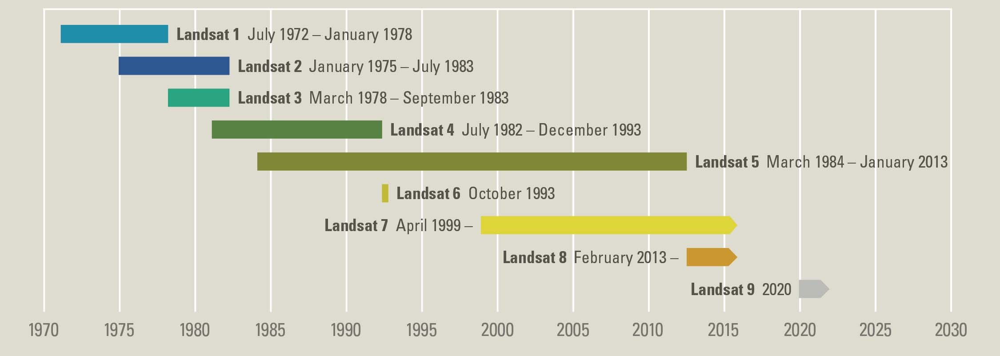
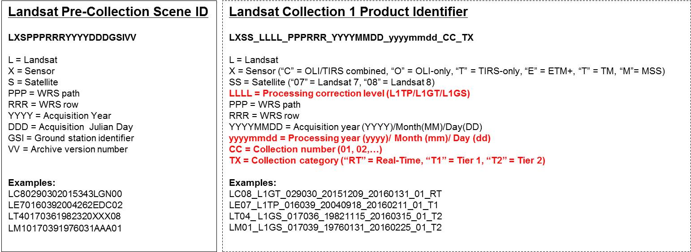

*******************
NASA/USGS - Landsat
*******************
.. note:: Tato stránka je postavena na obsahu oficiálního stránky projektu Landsat https://landsat.usgs.gov/

Projekt Landsat reprezentuje nejdelší (od 1972) kontinuální sběr družicových dat středního rozlišení. Data jsou celosvětově využívána v zemědělství, geologii, lesnictví, v regionálním plánování nebo ve výzkumu globální změny. Projekt vznikl jako společná iniciativa U.S. Geological Survey (USGS) a NASA. Od roku 2008 jsou data poskytována zdarma, do roku 2008 stáhla data přibližně 600 dolarů za snímek. V současnosti se diskutuje o možnosti spoplatnění dat (https://www.nature.com/articles/d41586-018-04874-y, https://philippgaertner.github.io/2018/06/landsat-cost-estimator/)

===============
Program Landsat
===============

**Rozsah scény:** 170 km x 185 km

**Perioda oběhu:** Landsat 1-3 - 18 dní; Landsat 4-8 - 16 dní, přičemž dráhy Landsat 8 a 7 jsou v posunu tak aby byla oblast snímkovaná každých 8 dní

Landsat 1
^^^^^^^^^
1972 - 1978

**Senzory:**

Return Beam Vidicon (RBV)

    - provoz: od 23. července 1972 do 5 srpna 1972 (pouze 1692)
    - rozlišení 80 m
    
Multispectral Scanner (MSS)
    
    - rozlišení: 80 m
    
Landsat 2
^^^^^^^^^
1975 - 1983

**Senzory:**

Return Beam Vidicon (RBV)

    - rozlišení: 80 m

Multispectral Scanner (MSS)

    - rozlišení: 80 m

Landsat 3
^^^^^^^^^
1978 - 1983

**Senzory:**

Return Beam Vidicon (RBV)

    - 2 kamery, panchromatické snímky (rozlišení 40m)
    
Multispectral Scanner (MSS)

    - rozlišení: 80 m
    
Landsat 4
^^^^^^^^^
1982 - 1993

**Senzory:**

Multispectral Scanner (MSS)

    - rozlišení: 80 m

Thematic Mapper (TM)

    - rozlišení: 30 m
    - + střední infračervené 30 m, a teplotní pásmo 120 m

Landsat 5
^^^^^^^^^
1984 - 2013

**Senzory:**

Multispectral Scanner (MSS)
    - rozlišení: 80 m
Thematic Mapper (TM)
    - rozlišení: 30 m, teplotní 120 m

Landsat 6
^^^^^^^^^
1993 (nedostal se na oběžnou dráhu)

**Senzory:**

Enhanced Thematic Mapper (ETM)

Landsat 7
^^^^^^^^^
1999 - současnost

**Senzory:**

Enhanced Thematic Mapper Plus (ETM+)

    - rozlišení: 30 m, teplotní 120 m
    
    - + panchromatické pásmo 15 m

Landsat 8
^^^^^^^^^
**Senzory:**

Operational Land Imager (OLI)

    - rozlišení: 30 m, PAN 15 m

Thermal Infrared Sensor (TIRS)

    - rozlišení: 100 m

Landsat 9
^^^^^^^^^
plánované spuštění v prosinci 2020

**Senzory:**

Operational Land Imager-2 (OLI-2)

Thermal Infrared Sensor-2 (TIRS-2)

Data Landsat
------------
Data jsou v archivu rozděleny do kolekcí - Landsat Collection Tiers podle míry předzpracování.

    *Tier 1 (T1)* - L1TP data po korekcích, kalibrována mezi různými senzory, připravena k analýzám časových řad

    *Tier 2 (T2)* - data, která nesplňují podmínky T1
    
    *Real-Time (RT)* - označení pro nově pořízená data, která jsou před zpracováním, potom se přesouvají do T1 nebo T2

   Metoda označení snímků

Datové produkty jsou dostupné ve dvou úrovních, *Landsat Level-1 Data Products*, data k okamžitému stažení a *Landsat Level-2 Science Products*, které jsou na požádání. Level-2 data jsou data odrazivosti (Surface Reflectance - SR) a další deriváty: top-of-atmosphere (TOA) a indexy (NDVI, NDMI, NBR, SAVI, EVI).

Stažení dat
^^^^^^^^^^^

EarthExplorer - grafický interface pro získávání dat

The File List Ordering Tool  - pořízení dat na základě textového seznamu snímků

The Bulk Download Application (BDA) - nástroj pro hromadné stažení objednávky nebo seznamu vybraných dat

pro Landsat Level-2 Science Products:

USGS Earth Resources Observation and Science (EROS) Center Science Processing Architecture (ESPA) On Demand Interface - umožňuje nahrání textového souboru (*.txt) s Landsat Collection 1 Level-1 a MODIS snímky. Lze zvolit požadované zmiňované produkty (TOA, SR, indexy), a nastavení výstupů, k dispozici je i tvorba grafů.

Objednávka na ESPA bývá vyříézena během 2-5 dnů, v závislosti na její velikosti, uživatel dostane notifikaci přes email.

ESPA Application Programming Interface (API)

Specifikace pásem senzorů
-------------------------

Return Beam Vidicon (RBV)

    Band 1 Visible blue-green (475-575 nm) 80 m

    Band 2 Visible orange-red (580-680 nm) 80 m

    Band 3 Visible red to Near-Infrared (690-830 nm) 80 m

Multispectral Scanner (MSS)

    Band 4 Visible green (0.5 to 0.6 µm) 80 m

    Band 5 Visible red (0.6 to 0.7 µm) 80 m

    Band 6 Near-Infrared (0.7 to 0.8 µm) 80 m

    Band 7 Near-Infrared (0.8 to 1.1 µm) 80 m

Thematic Mapper (TM)

    
    Band 1 Visible (0.45 - 0.52 µm) 30 m

    Band 2 Visible (0.52 - 0.60 µm) 30 m
    
    Band 3 Visible (0.63 - 0.69 µm) 30 m
    
    Band 4 Near-Infrared (0.76 - 0.90 µm) 30 m
    
    Band 5 Near-Infrared (1.55 - 1.75 µm) 30 m
    
    Band 6 Thermal (10.40 - 12.50 µm) 120 m
    
    Band 7 Mid-Infrared (IR) (2.08 - 2.35 µm) 30 m

Enhanced Thematic Mapper (ETM)

    Band 1 Visible (0.45 - 0.52 µm) 30 m

    Band 2 Visible (0.52 - 0.60 µm) 30 m

    Band 3 Visible (0.63 - 0.69 µm) 30 m

    Band 4 Near-Infrared (0.76 - 0.90 µm) 30 m

    Band 5 Near-Infrared (1.55 - 1.75 µm) 30 m

    Band 6 Thermal (10.40 - 12.50 µm) 120 m

    Band 7 Mid-Infrared (2.08 - 2.35 µm) 30 m

    Band 8 Panchromatic (PAN) (0.52 - 0.90 µm) 15 m

Enhanced Thematic Mapper Plus (ETM+)

    Band 1 Visible (0.45 - 0.52 µm) 30 m

    Band 2 Visible (0.52 - 0.60 µm) 30 m

    Band 3 Visible (0.63 - 0.69 µm) 30 m

    Band 4 Near-Infrared (0.77 - 0.90 µm) 30 m

    Band 5 Near-Infrared (1.55 - 1.75 µm) 30 m

    Band 6 Thermal (10.40 - 12.50 µm) 60 m Low Gain / High Gain

    Band 7 Mid-Infrared (2.08 - 2.35 µm) 30 m

    Band 8 Panchromatic (PAN) (0.52 - 0.90 µm) 15 m

Operational Land Imager (OLI)

    Band 1 Visible (0.43 - 0.45 µm) 30 m

    Band 2 Visible (0.450 - 0.51 µm) 30 m

    Band 3 Visible (0.53 - 0.59 µm) 30 m

    Band 4 Red (0.64 - 0.67 µm) 30 m

    Band 5 Near-Infrared (0.85 - 0.88 µm) 30 m

    Band 6 SWIR 1(1.57 - 1.65 µm) 30 m

    Band 7 SWIR 2 (2.11 - 2.29 µm) 30 m

    Band 8 Panchromatic (PAN) (0.50 - 0.68 µm) 15 m

    Band 9 Cirrus (1.36 - 1.38 µm) 30 m
     

Thermal Infrared Sensor (TIRS)

    Band 10 TIRS 1 (10.6 - 11.19 µm) 100 m

    Band 11 TIRS 2 (11.5 - 12.51 µm) 100 m
