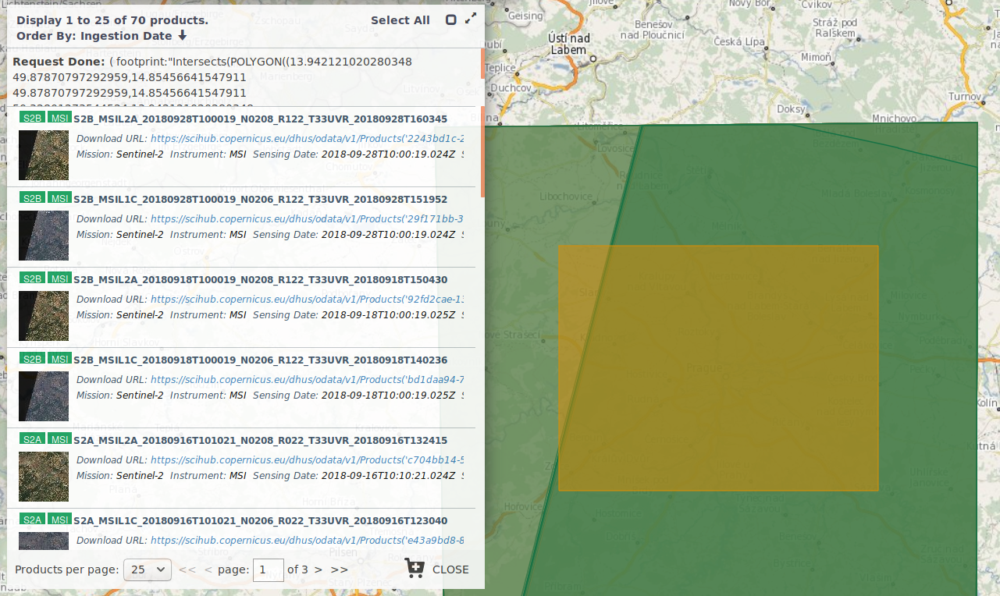

*********************
Copernicus - Sentinel
*********************

.. note:: Tato stránka je postavena na obsahu oficiálního stránky programu
        Copernicus http://copernicus.gov.cz

Copernicus je evropský program, primárně tedy slouží jako podpora pro
rozhodování při vytváření a provádění evropských politik zejména v oblasti
životního prostředí a bezpečnosti. 

Rychle dostupné informace za rozsáhlá území zvýší jistotu rozhodovacích procesů
(např. včasné a aktuální informace o rozsahu povodní pro záchranáře, ověřování
správnosti dotací pro zatravňované plochy, monitorování solárních panelů a boomu
solární energetiky a další možnosti kontroly provádění a naplňování národní
legislativy).

================
Program Sentinel
================

Družice Sentinel, vyvíjené v rámci kosmické komponenty Copernicus, tvoří celkem
5 řad - Sentinely 1 až 5.

Družice Sentinel
^^^^^^^^^^------

Sentinel 1
^^^^^^^^^^
Mise Sentinel 1 je zaměřena na sledování pevniny a moří, zejména monitorování
mořského ledu, oceánských vod, mořského pobřeží i polárních oblastí a navazuje
zejména na úspěšné mise družic Envisat a ERS-1. 

Konkrétní využití dat se předpokládá při povodních či deformacích terénu, které
bude možné pomocí radarové interferometrie detekovat s milimetrovou přesností.
Pro mapování zaplavených území je velkou výhodou fakt, že radarové snímky je na
rozdíl od optických dat možné pořizovat i přes oblačnost.

**Perioda oběhu:** jedna družice: 175 oběhů za 12 dní,obě družice: rovník 6 dní,
Evropa a Kanada 1-3 dny

**Prostorové rozlišení:** 5-40 m (v závislosti na módu)

Sentinel 2
^^^^^^^^^^

Družice Sentinel 2 jsou určeny především pro monitoring krajinného pokryvu a
mapování změn v území a využití ploch. Na své palubě nesou multispektrální
senzor, který navazuje na odkaz misí Landsat a SPOT.

**Perioda** jedna družice: 10 dní; obě družice: rovník 5 dní, Evropa a Kanada 2-3 dny

**Prostorové rozlišení:** 10-60 m (v závislosti na spektrálním pásmu)

Sentinel 3
^^^^^^^^^^

Družice Sentinel 3 budou poskytovat optická multispektrální i radarová data
středního rozlišení, čímž navážou především na data z družic Envisat a
Cryosat-2. Zaměřeny jsou zejména na pořizování barevných obrazových dat pro
monitorování pevniny a oceánů.

**Perioda**: 4+7/27 oběhů za den

**Prostorové rozlišení** 300 - 500 m

.. figure:: images/sentinel3-1.png
        :scale-latex: 80

.. figure:: images/sentinel3-2.png
        :scale-latex: 80

Sentinel 4
^^^^^^^^^^
Mise Sentinel 4 reprezentuje geostacionární složku Evropské operační mise pro
sledování složení atmosféry. Primárním účelem je monitoring stopových plynů
klíčových pro určování kvality ovzduší a to zejména O3, NO2, SO2, HCHO a
aerosolů ve vysokém časovém a prostorovém rozlišení, dále jsou to pak měření
slunečního záření a monitoring klimatu.

**Prostorové rozlišení** 8,9 km při snímání sever-jih, 11,7 km při snímání
        východ-západ na 45° s.š.

Sentinel 5
^^^^^^^^^^
Mise Sentinel 5 je určena pro monitorování atmosféry a jejím cílem je sledování
stopových plynů za účelem zjišťování chemického složení atmosféry a dále také
podpora monitorování klimatu. 

**Perioda** 29 dní

**Prostorové rozlišení** 	8 km pro vlnové délky nad 300 nm, 50 km pro vlnové
délky pod 300 nm

Stažení dat Sentinel
--------------------

Copernicus Open Access Hub
^^^^^^^^^^^^^^^^^^^^^^^^^^

Oficiální přístup k čerstvým datům programu Sentinel je na adrese
https://scihub.copernicus.eu/

Je nutné se registrovat. Portál zpřístupňuje data ze satelitů Sentinel 1-3 a
předprodukční data ze Sentinelu 5.

Copernicus ApiHub
^^^^^^^^^^^^^^^^^

Copernicus má API pro stahování dat, dostupné na adrese https://scihub.copernicus.eu/apihub/
 s dokumentací na https://scihub.copernicus.eu/twiki/do/view/SciHubUserGuide/BatchScripting?redirectedfrom=SciHubUserGuide.8BatchScripting

**Moduly pro Python**

* `srihub` - Unofficial scihub API
* `sentinelsat` - Utility to search and download Copernicus Sentinel satellite images
* `sentinel-s3` - Python libraries for extracting Sentinel-2's metadata from Amazon S3
* `sentinelhub` - Sentinel Hub Utilities
* `sentinelflow` - Automated satellite image workflow for Sentinel-2.
* `s2cloudless` - Sentinel Hub's cloud detector for Sentinel-2 imagery

Sentinel Hub
^^^^^^^^^^^^^
Alternativní přístup od Sinergise https://www.sentinel-hub.com/

Aplikace Playground, Explorer, ... https://apps.sentinel-hub.com/eo-browser/

Portál umožňuje jednoduché analýzy na klientovi on-line a stáhnout data ve
formátu GeoTIFF a JPG.

Víc o možnosti EOExploreru např. v `blogu GISMentors <http://gismentors.cz/blog/valka-v-syrii-v-primem-prenosu-dpz-pro-zacatecniky/>`_.
