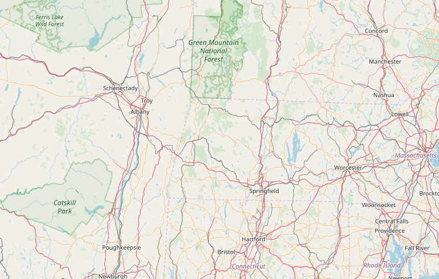
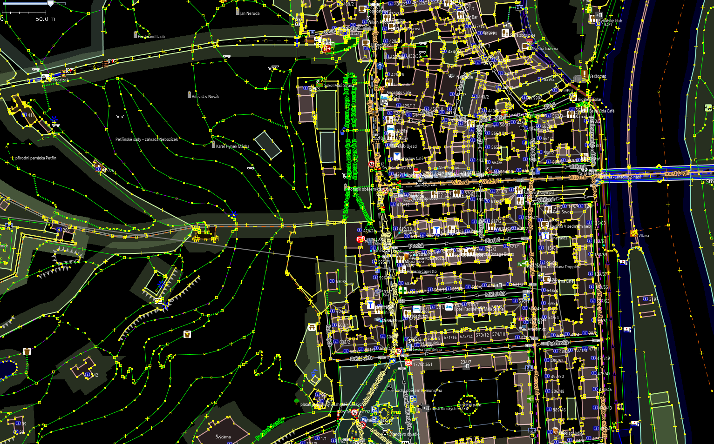
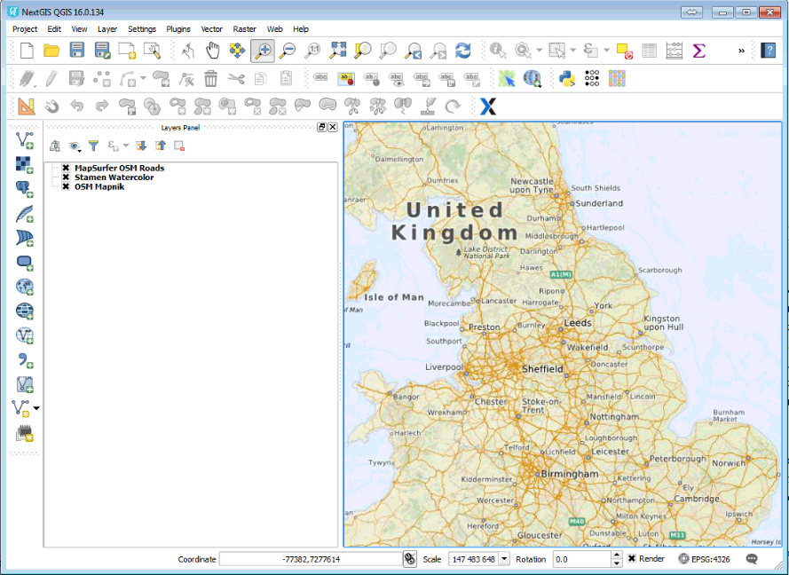

*********************
Veřejně dostupná data
*********************

=============
OpenStreetMap
=============

OpenStreetMap tvoří komunita uživatelů, kteří přidávají a udržují data o
silnicích, cestách, kavárnách, železničních stanicích a mnohém dalším po celém
světě.

http://openstreetmap.org | http://openstreetmap.cz

Kde stáhnout data z OSM
-----------------------

Export ve formátu OSM
^^^^^^^^^^^^^^^^^^^^^

Stažení kopie dat dané oblasti

https://www.openstreetmap.org/export

Overpass API
^^^^^^^^^^^^

Stažení dat, možnost atributových dotazů

* Dokumentace, nástroje http://overpass-api.de/
* Webové rozhranní http://overpass-turbo.eu/

Hotová prostorová data (\*.shp)
^^^^^^^^^^^^^^^^^^^^^^^^^^^^^^^

Předgenerované soubory

http://download.geofabrik.de/

Podkladová data do QGIS
^^^^^^^^^^^^^^^^^^^^^^^

QuickMapServices plugin http://nextgis.com/blog/quickmapservices/

======================
Data městských portálů
======================

---------
IPR Praha
---------

http://geoportal-praha.eu/

Otevřená data http://www.geoportalpraha.cz/cs/opendata#.W74F4RQzXMU 

Navzájem provázané Atom feedy, data ve formátech GeoJSON a Shapefile, JPG a
GeoTIFF.

Brno
----

https://data.brno.cz/

=======
INSPIRE
=======

Initiative for spatial data infrastructure for Europe. Směrnice pro sběr a
publikování dat o životním prostředí

Obecné informace: http://inspire.cz | https://inspire.ec.europa.eu/

Národní geoportál INSPIRE: http://geoportal.gov.cz

Evropský INSPIRE GeoPortál: http://inspire-geoportal.ec.europa.eu/

============
Další zdroje
============

* http://www.otevrenadata.cz/otevrena-data/zdroje-dat/
* https://gisgeography.com/free-satellite-imagery-data-list/

